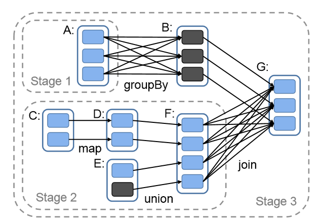

Spark Learning
==============

I'll kick it off with sharing some experience of Spark Streaming here.

Ramp up Mobius
----------------------------
Mobius provides Spark Api for C#, so we can write Spark Application in C#. For more about Mobius, you can go to [Microsoft/Mobius](https://github.com/Microsoft/Mobius).

To implement/submit Spark Application with Mobius, do the steps below:

1. check out Spark Steaming examples, the main logic of [SparkClrKafkaExample](https://github.com/Microsoft/Mobius/blob/master/examples/Streaming/Kafka/Program.cs) is simple and straightforward
2. install dependencies `VS toolbar -> Library Package Manager -> NuGet`
3. get started to write your own processing logic with Spark Api and generate your binaries
4. follow [running mobius app](https://github.com/Microsoft/Mobius/blob/master/notes/running-mobius-app.md#yarn-cluster) to setup your client box
5. submit your spark application
    `sparkclr-submit.cmd --master yarn --deploy-mode cluster --num-executors 6 --executor-cores 8 --executor-memory 20G --driver-memory 20G --conf spark.speculation=true --conf spark.yarn.am.attemptFailuresValidityInterval=30000 --conf spark.yarn.jar=hdfs:///user/delzh/lib/spark-assembly-1.6.1-nao-0.1-hadoop2.6.1-nao-0.1.jar --jars hdfs:///user/delzh/lib/spark-streaming-kafka-assembly_2.10-1.6.1.jar --exe SparkStreaming.exe e:\data\amd64 1>1.log 2>2.log`
6. check the running status from Yarn Resource Manager UI

Ramp up Spark
----------------------------
[Official docs](http://spark.apache.org/docs/latest/) is a good place to catch up, you can get an overall understanding then focus on your interested part.

So, what's Spark and what makes it powerful?

Apache Spark is a fast and general-purpose cluster computing system, and I think the core ideas that make it powerful and distinguish it from others are

1. it introduces an efficient abstraction for in-memory distributed computing : RDD - Resilient Distributed Dataset
2. it provides unified high-level APIs for both batch and streaming job

First, let's go deep into `RDD` : )
    Resilient: RDD is replicated in memory of multiple nodes, so it's able to auto recover in-memory state in case of node failures.
    Distributed: RDD is partitioned in memory of multiple node, each partition is a minimum parallel unit, so to enable parallel computing across Spark cluster.

RDD hides the complexity of cluster computing (data partition/replication, failover), so programmers can focus on business logic only and let Spark take care of the rest. From comments in Spark source code, each RDD is characterized by five main properties blow:

- A list of partitions
- A function for computing each split
- A list of dependencies on other RDDs
- Optionally, a Partitioner for key-value RDDs (e.g. to say that the RDD is hash-partitioned)
- Optionally, a list of preferred locations to compute each split on (e.g. block locations for an HDFS file)

So, how to create RDDs, what/how can we operate on RDDs? We can find the answers to these questions from [Spark offical docs](http://spark.apache.org/docs/latest/programming-guide.html#resilient-distributed-datasets-rdds).

For the first questions, there're two ways to create RDDs:
- parallelizing an existing collection in your driver program.
- referencing a dataset in an external storage system, such as a shared filesystem, HDFS, HBase, Kafka.

For the second one, RDDs support two kinds of operations:
- transformations, create new RDD from existing one, which are lazy operations.
- actions, operations that trigger computation and return result to the driver program.

When an action upon an RDD is operated, the scheduler (a service running in driver) will examines that RDD's lineage graph to build a DAG of stages to execute.
Let's take a look at the DAG below, understand the narrow and wide dependencies of RDD and find out how Spark computes job stages.

In above DAG example, Each box with solid outline is an RDD. Partitions are shaded rectangles, in black if they are already in memory.

To run an action on RDD G, the scheduler will build stages at wide dependencies and pipeline narrow transformations inside each stage. In fact stages are split by the shuffle operations required for wide dependencies, and any already computed partitions that can short-circuit the computation of a parent RDD. Then the scheduler will launches tasks to compute missing partitions from each stage until it has computed the target RDD.
For tasks within a stage which are narrow transformations, there're no communication with other nodes. For wide dependencies, there're shuffle operations and Spark currently materialize intermediate records on the nodes holding parent partitions to simplify `fault recovery`, much like what MapReduce does.

I'll put an end to the introduction of RDD here, if you understand all above, congrats, you have grasped the core concept of Spark!

Then let's go further to learn RDD APIs.

Spark Performance
----------------------------