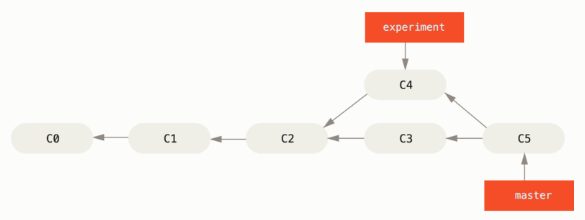
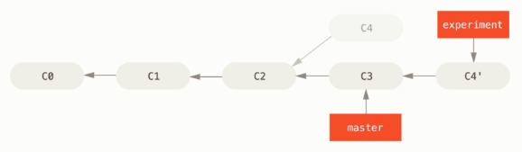
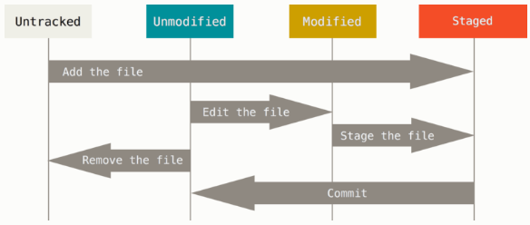

Get Started with Git
==============

Let's kick it off to understand what Git is and how it works, then it'll be pretty easy for us to use Git effectively and joyfully.

So, what is Git?
----------------------------
First, let's go through the major difference between Git and other VCS such as SVN:

1. Git stores file data as a set of snapshots, not a list of file-based changes or diff.
2. Almost all operations in Git can be done locally, no network is required.
3. Every commit will be check-summed before it's stored, and Git use SHA-1 for this checksum also known as commit id.
4. No need to worry about changes lost or messed up, for Git almost only do add operations to git directory (git repo).

Git Commands
----------------------------
The basic Git workflow looks like below, and we need to make clear of these three stages so to execute Git commands flexibly.

1. modify/new files in your `working directory`.
2. stage the files, adding snapshot of them to your `staging area`.
3. do a commit, storing the snapshot to your `git directory`.

Here're basic commands:

1. do not mess up with your github account, so better not use --global option

    `git config --global --add user.name "Firstname Lastname"`
    `git config --global --add user.email "alias@microsoft.com"`
2. clone from git remote repo, https, ssh or git protocol

    `git clone https://msasg.visualstudio.com/defaultcollection/bing_ads/_git/streamcomp`
3. create branch

    `git branch -b <new branch name>`
4. check your changes in working directory, it's good to do it before you do any other operations

    `git status`
5. stage changes and commit

    `git add *.cs` then `git commit -m 'commit msg''`, or directly `git commit -a -m 'commit msg''` if there's no new ops
7. merge with other branch

    `git checkout <your branch name>`, then `git merge <targeted branch name>`

   

8. rebase with other branch

    `git checkout <your branch name>`, then `git rebase <targeted branch name> -i`

   

9. push your changes to remote repo

    `git push origin <branch name>`, or you could `git branch --set-upstream <branch name> origin/<branch name>` and then you can do `git push` to achieve the same

Here's the state transition diagram of your files

Here're some advanced ones:

10. stash changes in staging area, and apply to other branch, or clear them

    `git stash`, `git stash list`, `git stash apply`, `git stash clear`
11. remove untracked files

    `git clean -fn` will display those to be deleted, `git clean -f` to remove them
12. checkout specific remote branch

    `git remote -v`, `git remote add <repo name> <remote repo url>`, `git fetch <repo name> <remote branch name>`, then `git checkout -b <branch name> <remote branch name>`
13. cherry-pick specific commit to your branch

    `git cherry-pick -n` cherry-pick to your working directory, or `git cherry-pick` to your branch directory
14. ignore the changes of some config file

    `git update-index --assume-unchanged <your file>`, `git update-index --no-assume-unchanged <your file>`
15. find out who to blame : )

    `git blame <file>`

Q&A
----------------------------

.
