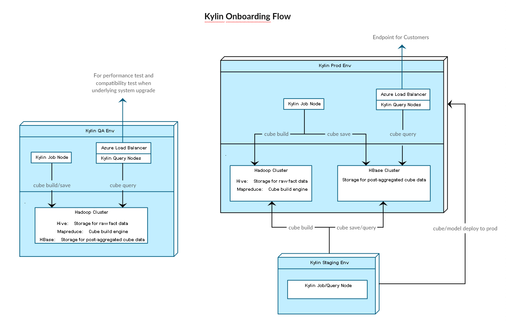
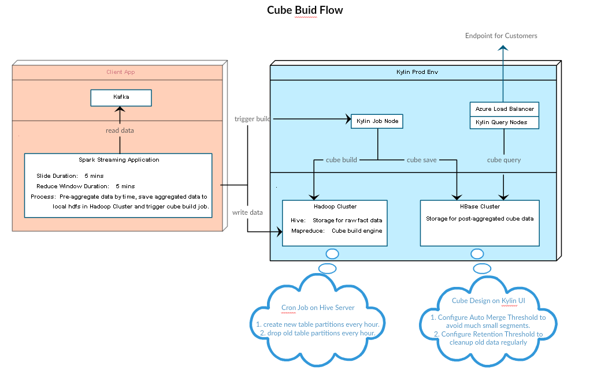

Kylin upon Azure
==============

Apache Kylin™ is an open source OLAP solution for Hadoop supporting extremely large datasets. You can go to [http://kylin.apache.org](http://kylin.apache.org/) for details.

Microsoft Azure is a cloud computing platform and infrastructure. You can go to [what-is-azure](https://azure.microsoft.com/en-us/overview/what-is-azure/) for details.

Here, I'll share some experience of Kylin deployment on Azure : )

Azure HDInsight
----------------------------
This Kylin cluster on Azure contains a Hadoop cluster and a separated Hbase cluster, so we can achieve *resource isolation* for "Cube Build" and "Cube Query".

Hadoop cluster and Hbase cluster are deployed with Azure HDInsight. HDInsight is a Hadoop solution on Azure and makes the Hadoop components from the Hortonworks Data Platform (HDP) distribution available in the cloud. See [Learn Hadoop on HDInsight](https://azure.microsoft.com/en-us/documentation/learning-paths/hdinsight-self-guided-hadoop-training/) for details.

One big difference from HDP is that Azure HDinsight uses Azure Blob storage as the default file system. Up till now, some of you may wonder how to integrate your client app with Azure Blob storage, or even have no intention/time to ramp up a new storage system.

No worries! HDInsight provides access to the DFS locally attached to the compute nodes as below. So you can integrate with hdfs in your client application as before.

`hdfs://<namenodehost>/<path>`

In addition, HDInsight provides the ability to access data stored in Azure Blob storage as blow. So that we can use the same storage container to achieve *seamless data sharing* for Hadoop cluster and Hbase cluster.

`wasb[s]://<containername>@<accountname>.blob.core.windows.net/<path>`

To make Kylin work on Azure HDInsight, I've added the PROPERTY KEYS below in kylin.properties, and modified KylinConfigBase.java and HadoopUtil.java to init these properties in Hadoop Configuration. With these changes, all data generated in cube build will be saved on Azure Blob storage.
You can check [Pull Request](https://github.com/apache/kylin/pull/41) for code changes.
```properties
kylin.source.hive.cluster-fs = wasb[s]://<containername>@<accountname>.blob.core.windows.net/
kylin.source.hive.azure.account = <accountname>
kylin.source.hive.azure.account-key = <accountkey>
```

And your client application can still save data on hdfs as before. All you have to do is to create an External Hive table as below and specify your local hdfs path as data source, and data will be moved from local hdfs in Hadoop cluster to Azure Blob storage in *Create Intermediate Flat Hive Table* step in cube build process.
```hivetable
CREATE EXTERNAL TABLE DatabaseName.TableName(
field1 timestamp,
... ,
fieldN int
)
PARTITIONED BY(d string, t string)
LOCATION 'hdfs://<namenodehost>/<raw data path>';
```

Kylin Envs and Onboarding Flow
----------------------------
To ensure the stability of Prod env, I've also setup QA and Staging env, the whole eco-system is shown as below.



QA env has a independent Kylin cluster and Hadoop cluster, when there's a need to upgrade underlying  systems, we can upgrade QA env, and do the performance test and compatibility test.
After all tests pass, then upgrade Prod env. Also, QA dev is used for application development.

Staging env shares the same underlying systems (Hive/Hbase) with Prod env, so we can do new cube design, review and build in staging env first, if all go well then onboard the new cube to prod env.

Kylin Cubing Flow
----------------------------
I'll present an example below to demonstrate a incremental build every five minutes for real-time analysis.



Cluster resource
----------------------------

#### Hadoop-2.7.1 cluster
| role        | count | resource                            |
| ----------- |:-----:| :-----------------------------------|
| head node   | 2     | D3 V2 (4 cores, 14G ram, 200G SSD)  |
| worker node | 24    | D3 V2 (4 cores, 14G ram, 200G SSD)  |


#### Hbase-0.98.4 cluster
| role        | count | resource                            |
| ----------- |:-----:| :-----------------------------------|
| head node   | 2     | A3 (4 cores, 7G ram)                |
| region node | 10    | D13 V2 (8 cores, 56G ram, 400G SSD) |
| zookeeper   | 3     | A3 (4 cores, 7G ram)                |

#### Kylin-1.5.3 Build cost
| granularity | record size | data size   | avg time cost (min)  |
| ----------- |:-----------:|:-----------:|:--------------------:|
| fiveminutes | 100K        | 11M         | 3.6                  |
| hourlymerge | 1M          | 126M        | 3.8                  |
| dailymerge  | 29M         | 3G          | 5.1                  |

#### Kylin-1.5.3 Query cost
| record size | data size   | avg time cost (s)  |
| ----------- |:-----------:| :--------------------|
| 820M        | 90G         | 1.4                  |

A more detailed benchmark performance test will be provided later, stay tuned.